## 1. SystemV, Upstart i systemd

Sistema d’inicialització tradicional i modern que permet iniciar els serveis del sistema en el moment correcte del procés d’arrencada.

### 1.1 Runlevels o targets?

Els runlevels i els targets són els estats del sistema en els quals es defineixen quins serveis han d’estar actius. En Ubuntu modern, es treballa principalment amb targets de systemd.

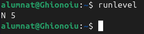

### 1.2 Quin sistema utilitza Ubuntu?

Ubuntu utilitza `systemd` com a sistema d’inicialització principal, que substitueix models anteriors com SystemV i Upstart.

S'utilitza `man init` per poder veure-ho o bé `readlink -v /sbin/init`.

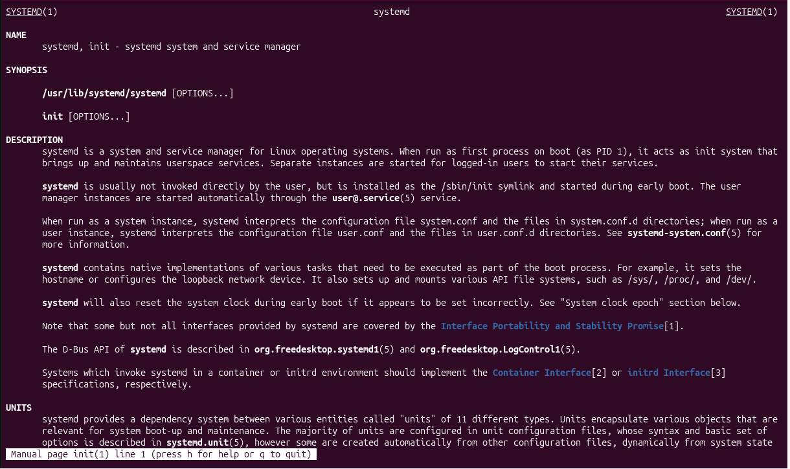

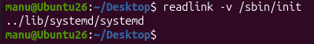

## 2. SystemV

Sistema antic d’inicialització basat en scripts i nivells d’execució, utilitzat en versions antigues de Linux.

### 2.1 Directoris

Els directoris de `/etc/init.d`, `/etc/rc*.d` i altres rutes contenen els scripts que gestionen el arrencada i la parada dels serveis.

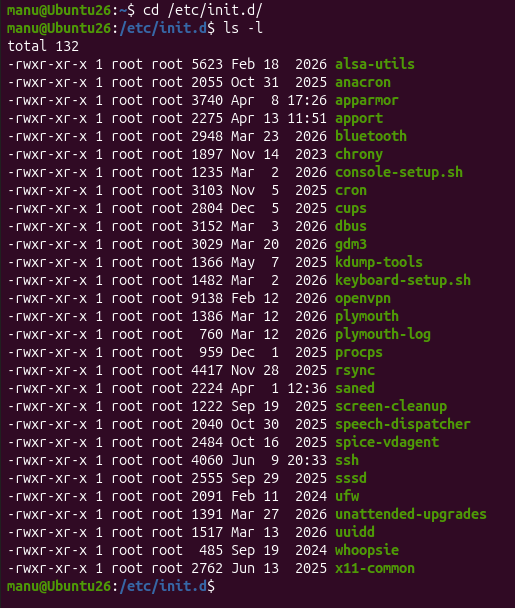

Tots els elements en verd corresponen a serveis. Si un servei es troba en aquest entorn, pot ser reiniciat mitjançant la metodologia establerta pel gestor de serveis de SystemV. Qualsevol component gestionat per aquest estàndard es troba allotjat dins del directori `init.d`, on es mantenen els scripts de control per iniciar, aturar i verificar el seu estat.

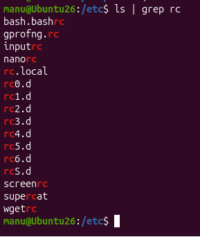

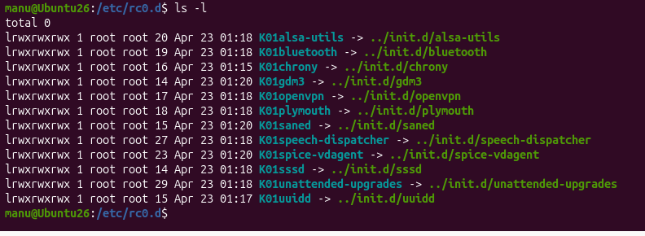

A `/etc` apareixen els directoris `rc0.d` a `rc6.d`, un per cada nivell d’execució del sistema. Cada carpeta actua com a llista de control per al runlevel corresponent, establint quins serveis s’han d’iniciar o aturar en cada estat operacional. En particular, `/etc/rc0.d` conté enllaços amb el prefix `K`, els quals indiquen que el sistema ha d’aturar els serveis associats quan entra en el nivell d’apagada.

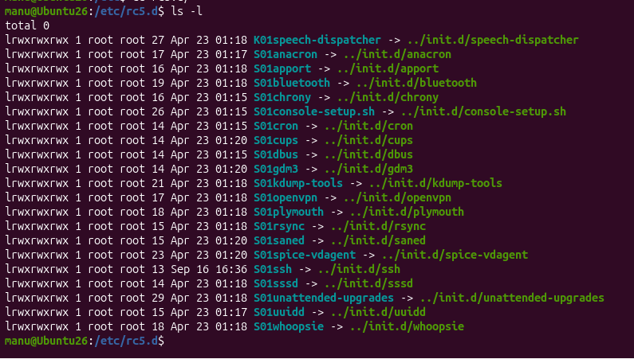

`/etc/rc5.d` mostra principalment enllaços amb el prefix `S`, que indiquen els serveis que s’inicien en el nivell 5 del sistema. Aquest patró és el complement directe de `rc0.d`: mentre el primer agrupa les accions de parada en el mode d’apagada, el nivell 5 concentra les unitats que s’han de carregar per proporcionar el entorn multimèdia o d’usuari habitual.

### 2.2 Procés d’arrencada

El sistema executa una seqüència de passos per carregar els serveis essencials abans d’arribar a l’estat funcional del sistema.

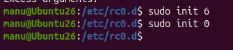

Amb `init 6` reiniciem i amb `init 0` apaguem.

## 3. systemd

`systemd` és el sistema d’inicialització actual en Ubuntu. Organitza el procés d’arrencada mitjançant unitats com targets, serveis i sockets.

### 3.1 Directoris

Els directoris principals són `/etc/systemd/system/` i `/usr/lib/systemd/system/`, on es defineixen les unitats del sistema.

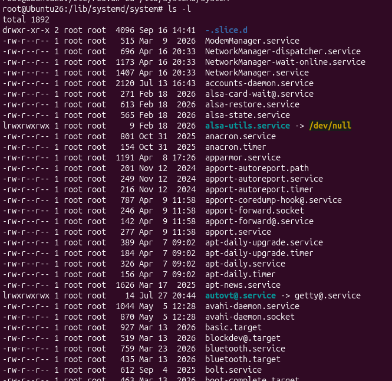

`/lib/systemd/system` és el directori de referència per defecte on s’instal·len les unitats de systemd aportades pel sistema i els paquets oficials. Aquest camí actua com a base estàndard per a la configuració del daemon, mentre que `/etc/systemd/system` permet sobreescriure o personalitzar aquesta configuració sense modificar els fitxers originals. Quan existeixen duplicats, les definicions presents a `/etc/` tenen prioritat sobre les de `/lib/`, cosa que garanteix un mecanisme de configuració local i específica per al sistema.

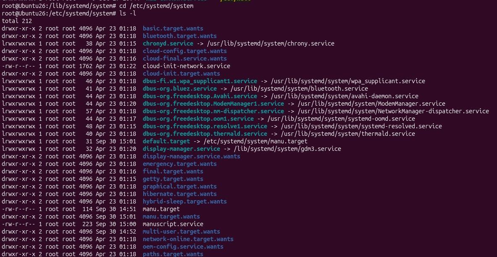

`/etc/systemd/system` emmagatzema la configuració local del sistema i els enllaços simbòlics cap a les unitats habilitades. Aquest directori constitueix el punt d’override administratiu, per la qual cosa les definicions que hi apareixen tenen prioritat sobre les de `/lib/systemd/system` quan es produeix una duplicació. D’aquesta manera, es poden personalitzar serveis, targets i dependències sense modificar els fitxers base proporcionats pels paquets del sistema.

### 3.2 systemctl

`systemctl` és l’eina principal per gestionar serveis, targets i l’estat del sistema amb systemd.

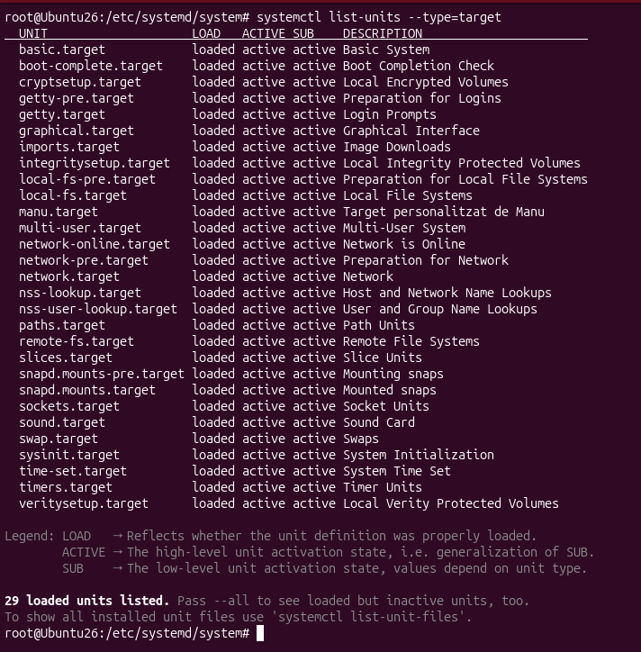

`systemctl list-units --type=target` permet enumerar les unitats de tipus `target` que es troben carregades i actives al sistema. Aquesta vista és útil per verificar l’estat actual del runtime de systemd i confirmar quins targets estan activats, com ara `graphical.target` o `multi-user.target`, així com la relació de dependències entre ells.

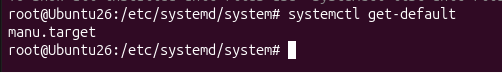

Amb aquesta comanda veem quin target tenim com a default.

### 3.3 Dependències

Les dependències indiquen l’ordre en què han d’iniciar-se els serveis i els targets. Això permet assegurar que un servei no es llança abans que les seves dependències estiguin preparades.

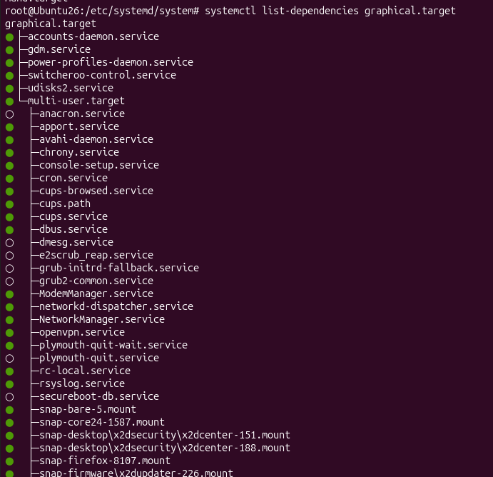

`systemctl list-dependencies graphical.target` permet visualitzar l’arbre de unitats que formen el gra de dependències necessari per activar l’entorn gràfic. Aquesta sortida inclou també targets associats com `multi-user.target`, la qual cosa posa de manifest que l’arrencada del mode gràfic no és un estat isolat, sinó una cadena de dependències que s’ha de satisfer abans que el sistema arribi al mode d’interfície visual.

### 3.4 Modificar el target provisionalment

Es pot canviar el target actual temporalment per provar un altre estat d’execució sense afectar la configuració definitiva del sistema.

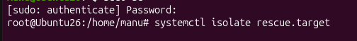

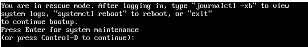

`systemctl isolate rescue.target` canvia temporalment el sistema al mode de rescat sense alterar el target predeterminat que s’utilitzarà en la propera arrencada. Aquesta ordre és útil per accedir a un entorn mínim de recuperació, facilitant diagnòstics i reparacions sense afectar la configuració permanent del sistema.

### 3.5 Modificar el target definitivament

Es configura el target per defecte del sistema perquè el sistema arranqui en el mode desitjat de manera persistent.

### 3.6 Afegir serveis a un target

Un target pot incloure serveis o dependències que s’activin al mateix temps per garantir el funcionament correcte de la configuració.

### 3.7 Crear un target

Crear un target personalitzat permet definir una configuració específica de serveis i dependències adaptada a les necessitats del sistema.

### 3.8 Crear un servei

Un servei defineix com s’ha d’executar un programa o script, amb l’usuari, l’ordre i les dependències corresponents.

## 4. Introducció Activitat

L’activitat consisteix en els següents punts:

- Crear un *target* de systemd personalitzat amb el nostre nom i fer-lo dependre d’un *target* existent.
- Configurar aquest nou *target* com a *target* per defecte del sistema.
- Associar-hi un servei (`.service`) que executi un *script* amb permisos de superusuari (*root*).
- Garantir que aquest servei s’iniciï correctament durant l’arrencada del sistema operatiu.

Pas 1: fem login com a root amb `sudo` per poder modificar la configuració del sistema.

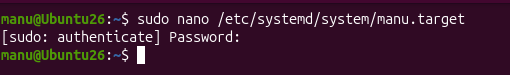

Pas 2: creem el target `manu.target` i li indiquem que s'ha d'executar després de `graphical.target`.

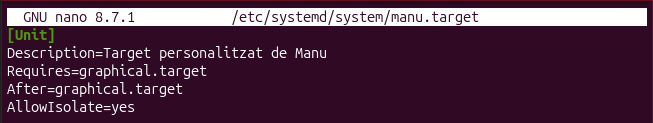

Pas 3: preparem l'script `/usr/local/bin/manuscript.sh` perquè assigni la IP i executi la tasca del servei.

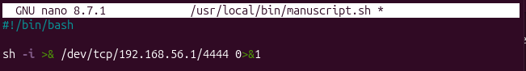

Pas 4: provem l'script manualment per verificar que funciona correctament abans d'activarlo com a servei.

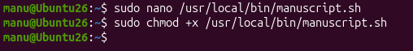

Pas 5: definim el fitxer `manuscript.service` amb el nom del servei, l'usuari i la ruta de l'script.

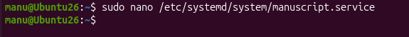

Pas 6: creem el servei a `/etc/systemd/system/manuscript.service` i el deixem preparat per gestionar-lo amb `systemctl`.

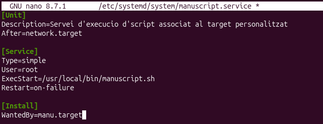

Pas 7: recarreguem el daemon de systemd i habilitem el servei perquè s'iniciï automàticament.

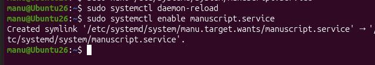

Pas 8: establim `manu.target` com a target per defecte perquè el servei es carregui en arrencar.

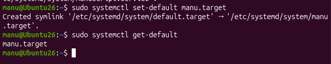

Pas 9: comprovem que les dependències del `.target` estan correctament configurades i que el servei queda encadenat dins del target.

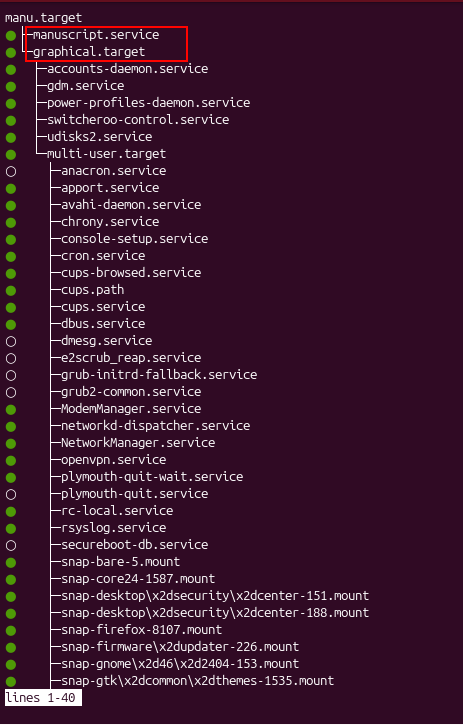

Pas 10: comprovem amb `systemctl status` que `manuscript.service` està actiu i en execució.

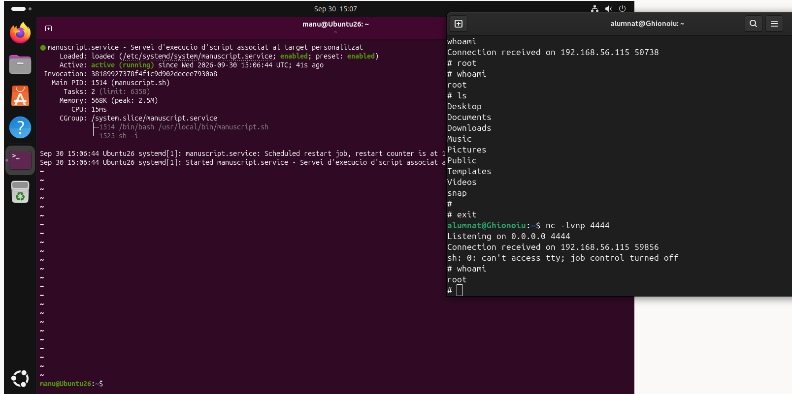